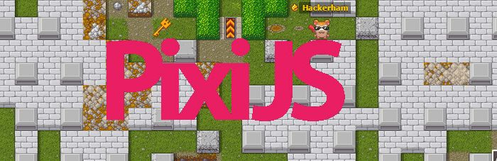

Fork that unleashes true power of Pixi.JS
=============

The aim of this fork is to experiment with [pixi.js](https://github.com/pixijs/pixi.js) and test new APIs that may be will be merged into official library.

### List of features ###

0. static transforms &mdash; No point of re-calculating matrices every frame if most of the scene is static.

1. Camera with z-index/z-order and culling &mdash; Ordering was pain in PIXI and Phaser. Now its gone!

2. Multiple cameras, proxy containers &mdash; Wanna make repeating world, make it like Thorus? Proxies FTW!

3. 2.5D transforms &mdash; Best of both worlds!

Test new APIs in [examples](https://gameofbombs.github.io/pixi-examples/index.html)

Binaries are located in [examples repository](https://github.com/gameofbombs/pixi-examples/)

### Contribute ###

Follow [Pixi.JS Contributing Guide](https://github.com/pixijs/pixi.js/blob/master/CONTRIBUTING.md) with a few exceptions:

1. Please do not commit binary files
2. All Pull Requests must be made for 'master' branch

### Authors ###

Fork was made by [@ivanpopelyshev](https://twitter.com/ivanpopelyshev)

Original library by [@doormat23](https://twitter.com/doormat23), [@rolnaaba](https://twitter.com/rolnaaba) and many others.

### License ###

This content is released under the (http://opensource.org/licenses/MIT) MIT License.
