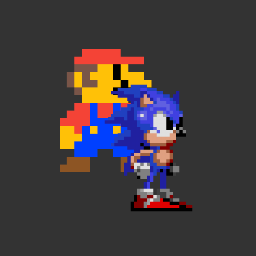
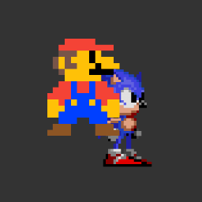

# Render Layers

RenderLayers let you control **draw order** independently of the **scene graph hierarchy**. An object keeps its parent's transform (position, scale, rotation) but gets drawn at the layer's position in the render order instead of its own.

Common use cases:
- **Health bars** that always render above the game world, even when the character moves behind obstacles
- **UI elements** (score, notifications) that stay on top regardless of scene complexity
- **Tutorial highlights** where one object renders in the foreground while everything else is pushed back

---

### **Key Concepts**

1. **Independent Rendering Order**:

   - RenderLayers allow control of the draw order independently of the logical hierarchy, ensuring objects are rendered in the desired order.

2. **Logical Parenting Stays Intact**:

   - Objects maintain transformations (e.g., position, scale, rotation) from their logical parent, even when attached to RenderLayers.

3. **Explicit Object Management**:

   - Objects must be manually reassigned to a layer after being removed from the scene graph or layer, ensuring deliberate control over rendering.

4. **Dynamic Sorting**:

   - Within layers, objects can be dynamically reordered using `zIndex` and `sortChildren` for fine-grained control of rendering order.

---

### **Basic API Usage**

First let's create two items that we want to render, red guy and blue guy.

```typescript
import { Sprite, Texture, RenderLayer } from 'pixi.js';

const texture = Texture.WHITE; // placeholder for your own texture

const redGuy = new Sprite(texture);
redGuy.tint = 0xff0000;

const blueGuy = new Sprite(texture);
blueGuy.tint = 0x0000ff;

stage.addChild(redGuy, blueGuy);
```



Now we know that red guy will be rendered first, then blue guy. Now in this simple example you could get away with just sorting the `zIndex` of the red guy and blue guy to help reorder.

But this is a guide about render layers, so lets create one of those.

Use `renderLayer.attach` to assign an object to a layer. This overrides the object’s default render order defined by its logical parent.

```typescript
// a layer..
const layer = new RenderLayer();
stage.addChild(layer);
layer.attach(redGuy);
```



So now our scene graph order is:

```
|- stage
    |-- redGuy
    |-- blueGuy
    |-- layer
```

And our render order is:

```
|- stage
    |-- blueGuy
    |-- layer
        |-- redGuy

```

This happens because the layer is now the last child in the stage. Since the red guy is attached to the layer, it will be rendered at the layer's position in the scene graph. However, it still logically remains in the same place in the scene hierarchy.

#### **Removing Objects from a Layer**

Now let's remove the red guy from the layer. To stop an object from being rendered in a layer, use `detach`. Once removed from the layer, it's still going to be in the scene graph, and will be rendered in its scene graph order.

```typescript
layer.detach(redGuy); //  Stop rendering the rect via the layer
```


Removing an object from its logical parent (`removeChild`) automatically removes it from the layer.

```typescript
stage.removeChild(redGuy); // if the red guy was removed from the stage, it will also be removed from the layer
```


However, if you remove the red guy from the stage and then add it back to the stage, it will not be added to the layer again.

```typescript
// add red guy to his original position
stage.addChildAt(redGuy, 0);
```


You will need to reattach it to the layer yourself.

```typescript
layer.attach(redGuy); // re attach it to the layer again!
```


This is intentional. Automatic re-attachment would cause subtle bugs: an object could silently rejoin a layer that was already removed from the scene. Explicit `layer.attach()` calls keep the render order predictable and debuggable.

#### **Layer Position in Scene Graph**

The layer’s position in the scene graph determines its render priority relative to other layers and objects.

```typescript
// reparent the layer to render first in the stage
stage.addChildAt(layer, 0);
```


### **Complete Example**

Here's a real-world example that shows how to use RenderLayers to set a player UI on top of the world.

@stackblitz(rendering_render-layer)
<br />

---

### **Gotchas and Things to Watch Out For**

1. **Manual Reassignment**:

   - When an object is re-added to a logical parent, it does not automatically reassociate with its previous layer. Always reassign the object to the layer explicitly.

2. **Nested Children**:

   - If you remove a parent container, all its children are automatically removed from layers. Be cautious with complex hierarchies.

3. **Sorting Within Layers**:

   - Objects in a layer can be sorted dynamically using their `zIndex` property. This is useful for fine-grained control of render order.

   ```javascript
   rect.zIndex = 10; // Higher values render later
   layer.sortableChildren = true; // Enable sorting
   layer.sortRenderLayerChildren(); // Apply the sorting
   ```

4. **Layer Overlap**:
   - If multiple layers overlap, their order in the scene graph determines the render priority. Ensure the layering logic aligns with your desired visual output.

---

### **Best Practices**

1. **Group Strategically**: Minimize the number of layers to optimize performance.
2. **Use for Visual Clarity**: Reserve layers for objects that need explicit control over render order.
3. **Test Dynamic Changes**: Verify that adding, removing, or reassigning objects to layers behaves as expected in your specific scene setup.

By understanding and leveraging RenderLayers effectively, you can achieve precise control over your scene's visual presentation while maintaining a clean and logical hierarchy.
