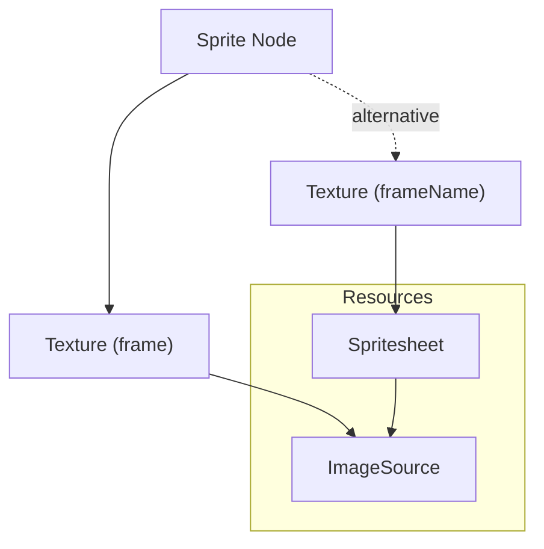

# Resources

[< Back to spec](./gl2D-spec.md)

Resources define reusable assets: textures, images, videos, fonts, graphics contexts, filters, styles, and more.

## URI Resolution

URIs are **relative to the `.gl2d` file's location**. Absolute URLs and data URIs are also permitted.

## Consumer Resource Map

A consumer (deserializer) may accept a **resource map**: a mapping from resource `uid` strings to pre-resolved objects. This allows the host application to provide resources it already has in memory (loaded textures, DOM elements, fonts, etc.) rather than having the deserializer resolve them from the file.

Resolution order for a resource:

1. If the resource's `uid` is present in the consumer-provided map, use the pre-resolved value
2. Otherwise, resolve from the resource's data (URI, selector, etc.)
3. If resolution fails, warn and skip the resource

The resource map is an implementation detail of the consumer; the gl2D file itself is unchanged. Resource definitions in the file serve as both declarations ("this scene needs a resource called X") and fallback resolution instructions.

This pattern is useful for:

- Pre-loaded textures the application already has in GPU memory
- DOM elements the application has already created
- Fonts already loaded by the page
- Any resource where the consumer knows better than the file how to resolve it

## Custom Resource Types

Third-party resource types are allowed via vendor-prefixed type names (e.g., `"type": "spine_skeleton"`). Unknown resource types are skipped by consumers; nodes referencing them degrade gracefully.

---

## Resource Types

- [Texture](#texture)
- [Texture Source](#texture-source)
    - [Image Source](#image-source)
    - [Video Source](#video-source)
    - [Buffer Image Source](#buffer-image-source)
- [Spritesheet](#spritesheet)
- [Graphics Context](#graphics-context)
- [Text Style](#text-style)
- [Canvas Gradient](#canvas-gradient)
- [Canvas Pattern](#canvas-pattern)
- [Web Font](#web-font)
- [Bitmap Font](#bitmap-font)
- [Filter](#filter)

---

## Texture

A texture resource represents a portion of a texture source. A texture's `source` can point to either:

- A **TextureSource** (e.g., `image_source`, `video_source`)
- A **Spritesheet resource** (`spritesheet`)

When source is an image/video source, `frame` defines the crop rectangle. When source is a spritesheet, `frameName` identifies the sub-image within the spritesheet.

```json
{
    "type": "texture",
    "uid": "heroTexture",
    "source": 0,
    "frame": [0, 0, 64, 64]
}
```

```json
{
    "type": "texture",
    "uid": "heroIdle01",
    "source": "atlas",
    "frameName": "hero_idle_01.png"
}
```

| Name      | Type             | Description                                                     | Required |
| --------- | ---------------- | --------------------------------------------------------------- | -------- |
| type      | "texture"        | Resource type                                                   | Yes      |
| uid       | string           | Unique identifier                                               | No       |
| name      | string           | Human-readable name                                             | No       |
| source    | number \| string | Reference to texture source or spritesheet resource             | Yes      |
| frame     | [x, y, w, h]     | Rectangle crop from source (used with image/video sources)      | No       |
| frameName | string           | Frame name within a spritesheet (used with spritesheet sources) | No       |



### PixiJS Texture Extension

```json
{
    "extensions": {
        "pixi_texture_resource": {
            "orig": [0, 0, 64, 64],
            "trim": [0, 0, 64, 64],
            "defaultAnchor": [0.5, 0.5],
            "defaultBorders": [0, 0, 0, 0],
            "rotate": 0,
            "dynamic": false
        }
    }
}
```

| Name           | Type                       | Description                    | Default | Required |
| -------------- | -------------------------- | ------------------------------ | ------- | -------- |
| orig           | [x, y, w, h]               | Original rectangle             |         | No       |
| trim           | [x, y, w, h]               | Trimmed rectangle              |         | No       |
| defaultAnchor  | [x, y]                     | Default anchor point           |         | No       |
| defaultBorders | [left, top, right, bottom] | Default borders                |         | No       |
| rotate         | number                     | Texture packer rotation value  | 0       | No       |
| dynamic        | boolean                    | Whether the texture is dynamic | false   | No       |

---

## Texture Source

Base type for texture data sources (images, videos, buffers).

```json
{
    "type": "texture_source",
    "uid": "heroImage",
    "uri": "/textures/hero.png",
    "width": 256,
    "height": 256,
    "resolution": 1,
    "format": "rgba8unorm",
    "alphaMode": "premultiplied-alpha",
    "addressMode": "clamp",
    "scaleMode": "linear"
}
```

| Name         | Type    | Description                                              | Default      | Required |
| ------------ | ------- | -------------------------------------------------------- | ------------ | -------- |
| type         | string  | Source type (`"image_source"`, `"video_source"`, etc.)   |              | Yes      |
| uid          | string  | Unique identifier                                        |              | No       |
| name         | string  | Human-readable name                                      |              | No       |
| uri          | string  | Path/URL/data URI to the resource                        |              | No       |
| width        | number  | Pixel width (actual pixels, not resolution-scaled)       |              | No       |
| height       | number  | Pixel height                                             |              | No       |
| resolution   | number  | Resolution scale factor (e.g., `2` for @2x)              | 1            | No       |
| format       | string  | Texture format (see [Texture Formats](#texture-formats)) | "rgba8unorm" | No       |
| antialias    | boolean | Whether to use antialiasing                              | false        | No       |
| alphaMode    | string  | Alpha mode (see [Alpha Modes](#alpha-modes))             |              | No       |
| addressMode  | string  | Wrap mode for U, V, W simultaneously                     | "clamp"      | No       |
| scaleMode    | string  | Sets mag/min/mipmap filters simultaneously               | "linear"     | No       |

### PixiJS Texture Source Extension

```json
{
    "extensions": {
        "pixi_texture_source_resource": {
            "addressModeU": "clamp",
            "addressModeV": "clamp",
            "addressModeW": "clamp",
            "magFilter": "linear",
            "minFilter": "linear",
            "mipmapFilter": "linear",
            "lodMinClamp": 0,
            "lodMaxClamp": 100,
            "dimensions": "2d",
            "mipLevelCount": 1,
            "autoGenerateMipmaps": true,
            "autoGarbageCollect": false,
            "compare": "less-equal",
            "maxAnisotropy": 1
        }
    }
}
```

| Name                | Type    | Description                           | Default | Required |
| ------------------- | ------- | ------------------------------------- | ------- | -------- |
| addressModeU        | string  | Wrap mode for U coordinate            |         | No       |
| addressModeV        | string  | Wrap mode for V coordinate            |         | No       |
| addressModeW        | string  | Wrap mode for W coordinate            |         | No       |
| magFilter           | string  | Magnification filter                  |         | No       |
| minFilter           | string  | Minification filter                   |         | No       |
| mipmapFilter        | string  | Mipmap level filter                   |         | No       |
| lodMinClamp         | number  | Minimum LOD clamp                     | 0       | No       |
| lodMaxClamp         | number  | Maximum LOD clamp                     | 100     | No       |
| dimensions          | string  | Texture dimensions ("1d", "2d", "3d") | "2d"    | No       |
| mipLevelCount       | number  | Number of mip levels                  | 1       | No       |
| autoGenerateMipmaps | boolean | Auto-generate mipmaps                 | false   | No       |
| autoGarbageCollect  | boolean | GC may unload when unused             | false   | No       |
| compare             | string  | Comparison sampler function           |         | No       |
| maxAnisotropy       | number  | Maximum anisotropy clamp              | 1       | No       |

### Alpha Modes

| Value                         | Description                    |
| ----------------------------- | ------------------------------ |
| "no-premultiply-alpha"        | No premultiplication on upload |
| "premultiply-alpha-on-upload" | Premultiply on upload          |
| "premultiplied-alpha"         | Already premultiplied          |

### Wrap Modes

| Value    | Description        |
| -------- | ------------------ |
| "repeat" | Repeat the texture |
| "clamp"  | Clamp to edge      |
| "mirror" | Mirror the texture |

### Scale Modes

| Value     | Description      |
| --------- | ---------------- |
| "linear"  | Linear filtering |
| "nearest" | Nearest neighbor |

### Compare Functions

| Value           | Description             |
| --------------- | ----------------------- |
| "never"         | Comparison always false |
| "less"          | Pass if src < dst       |
| "equal"         | Pass if src == dst      |
| "less-equal"    | Pass if src <= dst      |
| "greater"       | Pass if src > dst       |
| "not-equal"     | Pass if src != dst      |
| "greater-equal" | Pass if src >= dst      |
| "always"        | Comparison always true  |

### Texture Formats

| Format                | Description                                           |
| --------------------- | ----------------------------------------------------- |
| r8unorm               | 8-bit unsigned normalized R                           |
| r8snorm               | 8-bit signed normalized R                             |
| r8uint                | 8-bit unsigned integer R                              |
| r8sint                | 8-bit signed integer R                                |
| r16uint               | 16-bit unsigned integer R                             |
| r16sint               | 16-bit signed integer R                               |
| r16float              | 16-bit floating-point R                               |
| rg8unorm              | 8-bit unsigned normalized RG                          |
| rg8snorm              | 8-bit signed normalized RG                            |
| rg8uint               | 8-bit unsigned integer RG                             |
| rg8sint               | 8-bit signed integer RG                               |
| r32uint               | 32-bit unsigned integer R                             |
| r32sint               | 32-bit signed integer R                               |
| r32float              | 32-bit floating-point R                               |
| rg16uint              | 16-bit unsigned integer RG                            |
| rg16sint              | 16-bit signed integer RG                              |
| rg16float             | 16-bit floating-point RG                              |
| rgba8unorm            | 8-bit unsigned normalized RGBA                        |
| rgba8unorm-srgb       | 8-bit unsigned normalized RGBA (sRGB)                 |
| rgba8snorm            | 8-bit signed normalized RGBA                          |
| rgba8uint             | 8-bit unsigned integer RGBA                           |
| rgba8sint             | 8-bit signed integer RGBA                             |
| bgra8unorm            | 8-bit unsigned normalized BGRA                        |
| bgra8unorm-srgb       | 8-bit unsigned normalized BGRA (sRGB)                 |
| rgb9e5ufloat          | Packed RGB with shared 5-bit exponent (HDR)           |
| rgb10a2unorm          | 10-bit RGB + 2-bit A unsigned normalized              |
| rg11b10ufloat         | Packed 11-bit R/G + 10-bit B unsigned float (HDR)     |
| rg32uint              | 32-bit unsigned integer RG                            |
| rg32sint              | 32-bit signed integer RG                              |
| rg32float             | 32-bit floating-point RG                              |
| rgba16uint            | 16-bit unsigned integer RGBA                          |
| rgba16sint            | 16-bit signed integer RGBA                            |
| rgba16float           | 16-bit floating-point RGBA                            |
| rgba32uint            | 32-bit unsigned integer RGBA                          |
| rgba32sint            | 32-bit signed integer RGBA                            |
| rgba32float           | 32-bit floating-point RGBA                            |
| stencil8              | 8-bit stencil                                         |
| depth16unorm          | 16-bit unsigned normalized depth                      |
| depth24plus           | 24+ bit depth (implementation-defined)                |
| depth24plus-stencil8  | 24+ bit depth + 8-bit stencil                         |
| depth32float          | 32-bit floating-point depth                           |
| depth32float-stencil8 | 32-bit floating-point depth + 8-bit stencil           |
| bc1-rgba-unorm        | BC1/DXT1 compressed RGBA unsigned normalized          |
| bc1-rgba-unorm-srgb   | BC1/DXT1 compressed RGBA (sRGB)                       |
| bc2-rgba-unorm        | BC2/DXT3 compressed RGBA unsigned normalized          |
| bc2-rgba-unorm-srgb   | BC2/DXT3 compressed RGBA (sRGB)                       |
| bc3-rgba-unorm        | BC3/DXT5 compressed RGBA unsigned normalized          |
| bc3-rgba-unorm-srgb   | BC3/DXT5 compressed RGBA (sRGB)                       |
| bc4-r-unorm           | BC4 compressed R unsigned normalized                  |
| bc4-r-snorm           | BC4 compressed R signed normalized                    |
| bc5-rg-unorm          | BC5 compressed RG unsigned normalized                 |
| bc5-rg-snorm          | BC5 compressed RG signed normalized                   |
| bc6h-rgb-ufloat       | BC6H compressed RGB unsigned float (HDR)              |
| bc6h-rgb-float        | BC6H compressed RGB signed float (HDR)                |
| bc7-rgba-unorm        | BC7 compressed RGBA unsigned normalized               |
| bc7-rgba-unorm-srgb   | BC7 compressed RGBA (sRGB)                            |
| etc2-rgb8unorm        | ETC2 compressed RGB 8-bit unsigned normalized         |
| etc2-rgb8unorm-srgb   | ETC2 compressed RGB 8-bit (sRGB)                      |
| etc2-rgb8a1unorm      | ETC2 compressed RGB + 1-bit alpha unsigned normalized |
| etc2-rgb8a1unorm-srgb | ETC2 compressed RGB + 1-bit alpha (sRGB)              |
| etc2-rgba8unorm       | ETC2 compressed RGBA 8-bit unsigned normalized        |
| etc2-rgba8unorm-srgb  | ETC2 compressed RGBA 8-bit (sRGB)                     |
| eac-r11unorm          | EAC compressed R 11-bit unsigned normalized           |
| eac-r11snorm          | EAC compressed R 11-bit signed normalized             |
| eac-rg11unorm         | EAC compressed RG 11-bit unsigned normalized          |
| eac-rg11snorm         | EAC compressed RG 11-bit signed normalized            |
| astc-4x4-unorm        | ASTC 4x4 block, unsigned normalized                   |
| astc-4x4-unorm-srgb   | ASTC 4x4 block (sRGB)                                 |
| astc-5x4-unorm        | ASTC 5x4 block, unsigned normalized                   |
| astc-5x4-unorm-srgb   | ASTC 5x4 block (sRGB)                                 |
| astc-5x5-unorm        | ASTC 5x5 block, unsigned normalized                   |
| astc-5x5-unorm-srgb   | ASTC 5x5 block (sRGB)                                 |
| astc-6x5-unorm        | ASTC 6x5 block, unsigned normalized                   |
| astc-6x5-unorm-srgb   | ASTC 6x5 block (sRGB)                                 |
| astc-6x6-unorm        | ASTC 6x6 block, unsigned normalized                   |
| astc-6x6-unorm-srgb   | ASTC 6x6 block (sRGB)                                 |
| astc-8x5-unorm        | ASTC 8x5 block, unsigned normalized                   |
| astc-8x5-unorm-srgb   | ASTC 8x5 block (sRGB)                                 |
| astc-8x6-unorm        | ASTC 8x6 block, unsigned normalized                   |
| astc-8x6-unorm-srgb   | ASTC 8x6 block (sRGB)                                 |
| astc-8x8-unorm        | ASTC 8x8 block, unsigned normalized                   |
| astc-8x8-unorm-srgb   | ASTC 8x8 block (sRGB)                                 |
| astc-10x5-unorm       | ASTC 10x5 block, unsigned normalized                  |
| astc-10x5-unorm-srgb  | ASTC 10x5 block (sRGB)                                |
| astc-10x6-unorm       | ASTC 10x6 block, unsigned normalized                  |
| astc-10x6-unorm-srgb  | ASTC 10x6 block (sRGB)                                |
| astc-10x8-unorm       | ASTC 10x8 block, unsigned normalized                  |
| astc-10x8-unorm-srgb  | ASTC 10x8 block (sRGB)                                |
| astc-10x10-unorm      | ASTC 10x10 block, unsigned normalized                 |
| astc-10x10-unorm-srgb | ASTC 10x10 block (sRGB)                               |
| astc-12x10-unorm      | ASTC 12x10 block, unsigned normalized                 |
| astc-12x10-unorm-srgb | ASTC 12x10 block (sRGB)                               |
| astc-12x12-unorm      | ASTC 12x12 block, unsigned normalized                 |
| astc-12x12-unorm-srgb | ASTC 12x12 block (sRGB)                               |

Note: Availability of compressed formats depends on platform features (e.g., texture-compression-bc/etc2/astc).

### Image Source

Extends TextureSource. Represents a 2D image.

```json
{
    "type": "image_source",
    "uid": "heroImage",
    "uri": "/textures/hero.png"
}
```

### Video Source

Extends TextureSource. Represents a 2D video.

```json
{
    "type": "video_source",
    "uri": "/videos/intro.mp4",
    "autoPlay": true,
    "loop": true,
    "muted": true
}
```

| Name        | Type    | Description                | Default | Required |
| ----------- | ------- | -------------------------- | ------- | -------- |
| autoLoad    | boolean | Whether to preload video   | true    | No       |
| autoPlay    | boolean | Whether to autoplay video  | true    | No       |
| crossorigin | string  | Cross-origin attribute     |         | No       |
| loop        | boolean | Whether video loops        | false   | No       |
| muted       | boolean | Whether video is muted     | true    | No       |
| playsinline | boolean | Whether video plays inline | true    | No       |
| preload     | boolean | Whether to fully preload video | false | No       |
| fps         | "auto" \| number | Frame rate cap ("auto" = every render) | "auto" | No |

### Buffer Image Source

Extends TextureSource. Represents raw pixel data from a TypedArray or ArrayBuffer. The `uri` field contains the raw pixel data as a flat number array rather than a path or data URI. The `format` field indicates the GPU texture format and implicitly determines the expected TypedArray type (e.g., `rgba32float` for `Float32Array`, `bgra8unorm` for `Uint8Array`).

```json
{
    "type": "buffer_image_source",
    "uid": "noiseBuffer",
    "width": 4,
    "height": 1,
    "format": "bgra8unorm",
    "uri": [255, 0, 0, 255, 0, 255, 0, 255, 0, 0, 255, 255, 255, 255, 255, 255]
}
```

The `uri` field is a flat number array containing the pixel data. No additional properties beyond the base [Texture Source](#texture-source) fields.

---

## Spritesheet

Represents a collection of sprites packed into a single texture atlas.

```json
{
    "type": "spritesheet",
    "uid": "atlas",
    "uri": "/spritesheets/atlas.json",
    "source": 0
}
```

| Name   | Type             | Description                              | Required |
| ------ | ---------------- | ---------------------------------------- | -------- |
| type   | "spritesheet"    | Resource type                            | Yes      |
| uid    | string           | Unique identifier                        | No       |
| name   | string           | Human-readable name                      | No       |
| uri    | string           | Path/URL to the spritesheet JSON file    | Yes      |
| source | number \| string | Reference to the underlying image source | Yes      |

### PixiJS Spritesheet Extension

```json
{
    "extensions": {
        "pixi_spritesheet": {
            "cachePrefix": "atlas_"
        }
    }
}
```

| Name        | Type   | Description           | Required |
| ----------- | ------ | --------------------- | -------- |
| cachePrefix | string | Prefix for cache keys | No       |

---

## Graphics Context

A shared set of vector drawing commands. Multiple [graphics nodes](./gl2D-nodes.md#graphics) can reference the same context.

The command list mirrors PixiJS's GraphicsContext API. Fill and stroke style commands are interleaved with path commands.

```json
{
    "type": "graphics_context",
    "uid": "playerShape",
    "commands": [
        { "action": "beginFill", "color": "#ff0000", "alpha": 1 },
        { "action": "moveTo", "x": 0, "y": 0 },
        { "action": "lineTo", "x": 100, "y": 0 },
        { "action": "lineTo", "x": 100, "y": 100 },
        { "action": "closePath" },
        { "action": "endFill" },
        { "action": "beginStroke", "color": "#0000ff", "width": 2 },
        { "action": "moveTo", "x": 0, "y": 0 },
        { "action": "lineTo", "x": 100, "y": 0 },
        { "action": "endStroke" }
    ]
}
```

| Name     | Type               | Description                   | Required |
| -------- | ------------------ | ----------------------------- | -------- |
| type     | "graphics_context" | Resource type                 | Yes      |
| uid      | string             | Unique identifier             | No       |
| name     | string             | Human-readable name           | No       |
| commands | array              | Ordered list of draw commands | Yes      |

### Command Vocabulary

#### Path Commands

| Action           | Parameters                                           | Description                   |
| ---------------- | ---------------------------------------------------- | ----------------------------- |
| moveTo           | x, y                                                 | Move pen to position          |
| lineTo           | x, y                                                 | Draw line to position         |
| bezierCurveTo    | cp1x, cp1y, cp2x, cp2y, x, y                         | Cubic bezier curve            |
| quadraticCurveTo | cpx, cpy, x, y                                       | Quadratic bezier curve        |
| arc              | x, y, radius, startAngle, endAngle, counterclockwise | Circular arc                  |
| arcTo            | x1, y1, x2, y2, radius                               | Arc between two tangent lines |
| closePath        |                                                      | Close current sub-path        |
| rect             | x, y, width, height                                  | Rectangle                     |
| circle           | x, y, radius                                         | Circle                        |
| ellipse          | x, y, halfWidth, halfHeight                          | Ellipse                       |
| roundRect        | x, y, width, height, radius                          | Rounded rectangle             |
| poly             | points, close                                        | Polygon from flat point array |

#### Style Commands

| Action      | Parameters                                            | Description            |
| ----------- | ----------------------------------------------------- | ---------------------- |
| beginFill   | color, alpha, texture, matrix                         | Begin a fill region    |
| endFill     |                                                       | End the current fill   |
| beginStroke | color, alpha, width, alignment, cap, join, miterLimit | Begin a stroke region  |
| endStroke   |                                                       | End the current stroke |

Fill and stroke `color` fields use CSS color strings. `texture` is a reference to a texture resource (for textured fills).

---

## Text Style

Defines reusable styling for text rendering.

```json
{
    "type": "text_style",
    "uid": "heading",
    "fontFamily": ["Arial", "Helvetica", "sans-serif"],
    "fontSize": 24,
    "fill": "#ffffff",
    "align": "center",
    "fontWeight": "bold",
    "stroke": {
        "fill": "#000000",
        "width": 2,
        "alignment": 0.5
    },
    "shadow": {
        "color": "#000000",
        "offsetX": 2,
        "offsetY": 2,
        "blur": 4,
        "alpha": 0.5
    },
    "wordWrap": {
        "enabled": true,
        "width": 400
    }
}
```

| Name          | Type               | Description                                           | Default   | Required |
| ------------- | ------------------ | ----------------------------------------------------- | --------- | -------- |
| type          | "text_style"       | Resource type                                         |           | Yes      |
| uid           | string             | Unique identifier                                     |           | No       |
| name          | string             | Human-readable name                                   |           | No       |
| fontFamily    | string \| string[] | Font family name(s) in priority order                 |           | Yes      |
| align         | string             | Text alignment ("left", "center", "right", "justify") | "left"    | No       |
| fontSize      | number             | Font size in pixels                                   | 26        | No       |
| fontStyle     | string             | Font style ("normal", "italic", "oblique")            | "normal"  | No       |
| fontVariant   | string             | Font variant ("normal", "small-caps")                 | "normal"  | No       |
| fontWeight    | string \| number   | Font weight ("normal", "bold", 100-900)               | "normal"  | No       |
| fill          | string             | Fill color (CSS color string)                         | "#000000" | No       |
| letterSpacing | number             | Additional character spacing in pixels                | 0         | No       |
| padding       | number             | Text padding in pixels                                | 0         | No       |
| stroke        | object             | Stroke configuration                                  |           | No       |
| shadow        | object             | Drop shadow configuration                             |           | No       |
| textBaseline  | string             | Vertical alignment baseline                           |           | No       |
| wordWrap      | object             | Word wrapping configuration                           |           | No       |

### Stroke Configuration

| Name       | Type   | Description                                 | Default | Required |
| ---------- | ------ | ------------------------------------------- | ------- | -------- |
| fill       | string | Stroke color (CSS color string)             |         | Yes      |
| width      | number | Stroke width in pixels                      | 1       | No       |
| alignment  | number | Stroke alignment (0.0-1.0)                  | 0.5     | No       |
| cap        | string | Line cap style ("butt", "round", "square")  | "butt"  | No       |
| join       | string | Line join style ("miter", "round", "bevel") | "miter" | No       |
| miterLimit | number | Miter limit for sharp joins                 | 10      | No       |

### Shadow Configuration

| Name    | Type   | Description                        | Default   | Required |
| ------- | ------ | ---------------------------------- | --------- | -------- |
| color   | string | Shadow color (CSS color string)    | "#000000" | No       |
| offsetX | number | Horizontal shadow offset in pixels | 0         | No       |
| offsetY | number | Vertical shadow offset in pixels   | 0         | No       |
| blur    | number | Shadow blur radius in pixels       | 0         | No       |
| alpha   | number | Shadow opacity (0.0-1.0)           | 1         | No       |

### Word Wrap Configuration

| Name    | Type    | Description                     | Default | Required |
| ------- | ------- | ------------------------------- | ------- | -------- |
| enabled | boolean | Whether to enable word wrapping | false   | No       |
| width   | number  | Maximum width before wrapping   |         | No       |

### PixiJS Text Style Extension

```json
{
    "extensions": {
        "pixi_text_style_resource": {
            "trim": true,
            "leading": 4,
            "lineHeight": 28,
            "breakWords": false,
            "whiteSpace": "normal"
        },
    }
}
```

| Name       | Type    | Description                                    | Default | Required |
| ---------- | ------- | ---------------------------------------------- | ------- | -------- |
| trim       | boolean | Auto-trim transparent pixels from text texture | false   | No       |
| leading    | number  | Additional spacing between lines in pixels     | 0       | No       |
| lineHeight | number  | Explicit line height in pixels                 |         | No       |
| breakWords | boolean | Allow breaking within words                    | false   | No       |
| whiteSpace | string  | CSS-style whitespace handling                  | "pre"   | No       |

---

## Canvas Gradient

Defines linear or radial color gradients for use in fills and strokes.

```json
{
    "type": "canvas_gradient",
    "uid": "heroGlow",
    "gradientType": "radial",
    "gradientUnits": "local",
    "radial": {
        "outerCircle": [0.5, 0.5, 0.8],
        "innerCircle": [0.5, 0.5, 0.2]
    },
    "stops": [0.0, "#ffffff", 0.5, "#ffff00", 1.0, "#ff0000"]
}
```

| Name          | Type              | Description                            | Required |
| ------------- | ----------------- | -------------------------------------- | -------- |
| type          | "canvas_gradient" | Resource type                          | Yes      |
| uid           | string            | Unique identifier                      | No       |
| name          | string            | Human-readable name                    | No       |
| gradientType  | string            | Gradient geometry ("linear", "radial") | Yes      |
| gradientUnits | string            | Coordinate system ("local", "global")  | Yes      |
| stops         | array             | Alternating [position, color] values   | Yes      |
| linear        | object            | Linear gradient configuration          | No       |
| radial        | object            | Radial gradient configuration          | No       |

### Linear Gradient Configuration

| Name  | Type             | Description             | Required |
| ----- | ---------------- | ----------------------- | -------- |
| start | [number, number] | Starting point `[x, y]` | Yes      |
| end   | [number, number] | Ending point `[x, y]`   | Yes      |

### Radial Gradient Configuration

| Name        | Type                     | Description                               | Required |
| ----------- | ------------------------ | ----------------------------------------- | -------- |
| outerCircle | [number, number, number] | Outer circle `[centerX, centerY, radius]` | Yes      |
| innerCircle | [number, number, number] | Inner circle `[centerX, centerY, radius]` | Yes      |

### PixiJS Canvas Gradient Extension

```json
{
    "extensions": {
        "pixi_canvas_gradient": {
            "textureSize": 256,
            "wrapMode": "clamp-to-edge",
            "scale": 1.5,
            "rotation": 0.785
        }
    }
}
```

| Name        | Type   | Description                           | Default | Required |
| ----------- | ------ | ------------------------------------- | ------- | -------- |
| textureSize | number | Texture size for gradient rendering   | 256     | No       |
| wrapMode    | string | Wrap mode ("clamp-to-edge", "repeat") |         | No       |
| scale       | number | Y-scale for elliptical gradients      | 1       | No       |
| rotation    | number | Rotation for elliptical gradients     | 0       | No       |

---

## Canvas Pattern

Defines repeating texture patterns for use in fills and strokes.

```json
{
    "type": "canvas_pattern",
    "uid": "brickPattern",
    "source": 0,
    "repeat": "repeat",
    "transform": [1, 0, 0, 1, 0, 0]
}
```

| Name      | Type                                             | Description                   | Default  | Required |
| --------- | ------------------------------------------------ | ----------------------------- | -------- | -------- |
| type      | "canvas_pattern"                                 | Resource type                 |          | Yes      |
| uid       | string                                           | Unique identifier             |          | No       |
| name      | string                                           | Human-readable name           |          | No       |
| source    | number \| string                                 | Reference to texture resource |          | Yes      |
| repeat    | string                                           | Repetition behavior           | "repeat" | No       |
| transform | [number, number, number, number, number, number] | 2D transformation matrix      |          | No       |

### Repeat Values

| Value       | Description                         |
| ----------- | ----------------------------------- |
| "repeat"    | Repeat in both directions (default) |
| "repeat-x"  | Repeat horizontally only            |
| "repeat-y"  | Repeat vertically only              |
| "no-repeat" | No repetition                       |

---

## Web Font

Defines a web font for text rendering.

```json
{
    "type": "web_font",
    "uid": "customFont",
    "uri": "/fonts/custom-font.woff2",
    "family": "CustomFont",
    "weights": ["400", "700"],
    "style": "normal",
    "display": "swap"
}
```

| Name            | Type       | Description             | Default | Required |
| --------------- | ---------- | ----------------------- | ------- | -------- |
| type            | "web_font" | Resource type           |         | Yes      |
| uid             | string     | Unique identifier       |         | No       |
| name            | string     | Human-readable name     |         | No       |
| uri             | string     | Path/URL to font file   |         | No       |
| family          | string     | Font family name        |         | Yes      |
| weights         | string[]   | Available font weights  |         | No       |
| style           | string     | Font style descriptor   |         | No       |
| display         | string     | Font display behavior   | "swap"  | No       |
| stretch         | string     | Font stretch descriptor |         | No       |
| unicodeRange    | string     | Unicode range for font  |         | No       |
| variant         | string     | Font variant descriptor |         | No       |
| featureSettings | string     | Font feature settings   |         | No       |

---

## Bitmap Font

Defines a pre-rendered bitmap font atlas.

```json
{
    "type": "bitmap_font",
    "uid": "gameUIFont",
    "uri": "/fonts/game-ui.fnt",
    "fontFamily": "GameUI"
}
```

| Name       | Type          | Description         | Required |
| ---------- | ------------- | ------------------- | -------- |
| type       | "bitmap_font" | Resource type       | Yes      |
| uid        | string        | Unique identifier   | No       |
| name       | string        | Human-readable name | No       |
| uri        | string        | Path/URL to font    | No       |
| fontFamily | string        | Font family name    | Yes      |

---

## Filter

Defines a visual effect that can be applied to nodes. Filter types use the open type system; the core spec defines standard filters, and engines can add vendor-specific ones.

Nodes reference filters via the [`gl2d_filters`](./gl2D-extensions.md#gl2d_filters) standard extension.

```json
{
    "type": "filter",
    "uid": "backgroundBlur",
    "filterType": "blur",
    "params": {
        "strength": 8,
        "quality": 4
    }
}
```

| Name       | Type     | Description                | Required |
| ---------- | -------- | -------------------------- | -------- |
| type       | "filter" | Resource type              | Yes      |
| uid        | string   | Unique identifier          | No       |
| name       | string   | Human-readable name        | No       |
| filterType | string   | Filter type identifier     | Yes      |
| params     | object   | Filter-specific parameters | No       |

### Standard Filter Types

#### blur

| Parameter | Type   | Description             | Default |
| --------- | ------ | ----------------------- | ------- |
| strength  | number | Blur strength in pixels | 8       |
| quality   | number | Blur quality (passes)   | 4       |

#### alpha

| Parameter | Type   | Description           | Default |
| --------- | ------ | --------------------- | ------- |
| alpha     | number | Alpha value (0.0-1.0) | 1       |

Vendor-specific filter types use prefixed names: `"filterType": "pixi_displacement"`, `"filterType": "pixi_color_matrix"`, etc.
