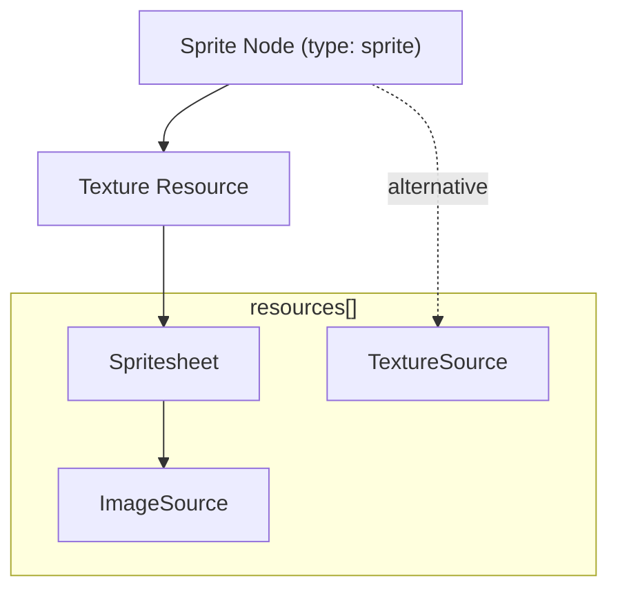

# gl2D File Format Specification

## 1. Introduction

The **gl2D file format** is a JSON-based scene description format designed for 2D rendering engines. It provides a structured way to describe:

- **Scenes** (collections of nodes)
- **Nodes** (containers, sprites, etc.)
- **Resources** (textures, images, videos, fonts, etc.)
- **Extensions** (engine-specific metadata)

gl2D is inspired by **glTF** but tailored for **2D graphics**, focusing on lightweight serialization, hierarchical scene graphs, and efficient resource referencing.

---

## 2. File Structure Overview

A gl2D file is a single JSON object with the following top-level structure:

```json
{
  "asset": { ... },
  "scene": 0,
  "scenes": [ ... ],
  "nodes": [ ... ],
  "resources": [ ... ],
  "extensionsUsed": [],
  "extensionsRequired": []
}
```

| Name               | Type   | Description                   | Required |
| ------------------ | ------ | ----------------------------- | -------- |
| asset              | object | Metadata about the gl2D asset | ✅ Yes   |
| scene              | number | Index of the default scene    | No       |
| scenes             | array  | Array of scene definitions    | No       |
| nodes              | array  | Array of node definitions     | No       |
| resources          | array  | Array of resource definitions | No       |
| extensionsUsed     | array  | List of used extensions       | No       |
| extensionsRequired | array  | List of required extensions   | No       |

---

## 3. Asset Metadata

The `asset` object describes the generator and versioning:

```json
"asset": {
  "version": "1.0",
  "generator": "PixiJS",
  "minVersion": "1.0"
}
```

| Name       | Type   | Description                        | Required |
| ---------- | ------ | ---------------------------------- | -------- |
| version    | string | GL2D spec version (e.g., `"1.0"`)  | ✅ Yes   |
| generator  | string | Tool/library that created the file | No       |
| minVersion | string | Minimum GL2D version required      | No       |

---

## 4. Scenes

A **scene** is a collection of root nodes. Multiple scenes can exist in one file (e.g., menu, gameplay, credits).
The default `scene` is the first one defined in the `scenes` array.

```json
"scenes": [
  {
    "name": "MainScene",
    "nodes": [0, 1]
  }
],
"scene": 0
```

| Name  | Type     | Description                             | Required |
| ----- | -------- | --------------------------------------- | -------- |
| name  | string   | Human-readable name of the scene        | ✅ Yes   |
| nodes | number[] | Indices into the global `nodes[]` array | ✅ Yes   |

---

## 5. Nodes

Nodes are the **building blocks** of a gl2D scene. They represent containers, sprites, or other visual elements.

### 5.1 Container Node

Groups other nodes, applies hierarchical transforms.

```json
{
    "type": "container",
    "name": "Player",
    "children": [1],
    "translation": [200, 150],
    "rotation": 0.5,
    "scale": [1, 1],
    "alpha": 1,
    "visible": true
}
```

| Name        | Type                                             | Description                                 | Required |
| ----------- | ------------------------------------------------ | ------------------------------------------- | -------- |
| type        | string                                           | Node type (`"container"`, `"sprite"`, etc.) | ✅ Yes   |
| uid         | string                                           | Unique identifier                           | No       |
| name        | string                                           | Human-readable name                         | No       |
| children    | number[]                                         | Indices of child nodes                      | No       |
| translation | [number, number]                                 | Position `[x, y]`                           | No       |
| rotation    | number                                           | Rotation in radians                         | No       |
| scale       | [number, number]                                 | Scale `[x, y]`                              | No       |
| matrix      | [number, number, number, number, number, number] | Transformation matrix override              | No       |
| width       | number                                           | Explicit width override                     | No       |
| height      | number                                           | Explicit height override                    | No       |
| blendMode   | enum                                             | Blend mode (normal, multiply, etc.)         | No       |
| tint        | number                                           | Color tint (0xRRGGBB)                       | No       |
| alpha       | number                                           | Opacity (0.0–1.0)                           | No       |
| visible     | boolean                                          | Whether the node is visible                 | No       |

#### PixiJS Container Extension

```json
{
    "extensions": {
        "pixi_container_node": {
            "skew": [0, 0],
            "pivot": [0, 0],
            "origin": [0.5, 0.5],
            "zIndex": 1,
            "renderable": true,
            "sortableChildren": true
        }
    }
}
```

| Name             | Type             | Description                            | Required |
| ---------------- | ---------------- | -------------------------------------- | -------- |
| skew             | [number, number] | Skew in radians `[x, y]`               | No       |
| pivot            | [number, number] | Pivot point in pixels `[x, y]`         | No       |
| origin           | [number, number] | Origin point in pixels `[x, y]`        | No       |
| anchor           | [number, number] | Anchor point (normalized `[0–1, 0–1]`) | No       |
| zIndex           | number           | Depth sorting order                    | No       |
| isRenderGroup    | boolean          | Treat as render group                  | No       |
| renderable       | boolean          | Whether node is rendered               | No       |
| boundsArea       | number[]         | Cached bounds area                     | No       |
| sortableChildren | boolean          | Auto-sort children by zIndex           | No       |

### 5.2 Sprite Node

Represents a texture based drawable element.

```json
{
    "type": "sprite",
    "texture": 0
}
```

| Name    | Type     | Description                                            | Required |
| ------- | -------- | ------------------------------------------------------ | -------- |
| type    | "sprite" | Node type "sprite"                                     | ✅ Yes   |
| texture | number   | Indices of the texture resource in the resources array | ✅ Yes   |

#### PixiJS Sprite Extension

```json
{
    "extensions": {
        "pixi_sprite_node": {
            "roundPixels": true
        }
    }
}
```

| Name        | Type    | Description                                 | Required |
| ----------- | ------- | ------------------------------------------- | -------- |
| roundPixels | boolean | Whether to round pixel values for rendering | No       |

---

### 5.3 Tiling Sprite Node

A **tiling sprite** is a special type of sprite that repeats (tiles) its texture to fill the node’s width and height.
This is useful for backgrounds, patterns, and infinite scrolling textures.

```json
{
    "type": "tiling_sprite",
    "texture": 0,
    "tileScale": [1, 1],
    "tilePosition": [0, 0],
    "tileRotation": 0
}
```

| Name         | Type             | Description                                               | Required |
| ------------ | ---------------- | --------------------------------------------------------- | -------- |
| type         | "tiling_sprite"  | Node type "tiling_sprite"                                 | ✅ Yes   |
| texture      | number           | Indices of the texture resource in the resources array    | ✅ Yes   |
| width        | number           | Width of the tiling sprite (area to be filled by tiling)  | No       |
| height       | number           | Height of the tiling sprite (area to be filled by tiling) | No       |
| tileScale    | [number, number] | Scale of the tiles `[x, y]`                               | No       |
| tilePosition | [number, number] | Position of the tiles `[x, y]`                            | No       |
| tileRotation | number           | Rotation of the tiles in radians                          | No       |

#### PixiJS Tiling Sprite Extension

```json
{
    "extensions": {
        "pixi_tiling_sprite_node": {
            "roundPixels": true,
            "applyAnchorToTexture": true
        }
    }
}
```

| Name                 | Type    | Description                                      | Required |
| -------------------- | ------- | ------------------------------------------------ | -------- |
| roundPixels          | boolean | Whether to round pixel values for rendering      | No       |
| applyAnchorToTexture | boolean | Whether to apply the anchor point to the texture | No       |

---

### 5.4 Nine Slice Sprite Node

A **nine slice sprite** is a special type of sprite that allows for scaling of the sprite's texture while preserving the corners and edges.

```json
{
    "type": "nine_slice_sprite",
    "texture": 0,
    "slice9": [10, 10, 10, 10]
},
{
    "type": "nine_slice_sprite",
    "texture": 0,
    "leftWidth": 10,
    "topHeight": 10,
    "rightWidth": 10,
    "bottomHeight": 10
}
```

| Name         | Type                             | Description                                             | Required |
| ------------ | -------------------------------- | ------------------------------------------------------- | -------- |
| type         | "nine_slice_sprite"              | Node type "nine_slice_sprite"                           | ✅ Yes   |
| texture      | number                           | Indices of the texture resource in the resources array  | ✅ Yes   |
| width        | number                           | Width of the nine-slice sprite                          | No       |
| height       | number                           | Height of the nine-slice sprite                         | No       |
| slice9       | [number, number, number, number] | The 9-slice scaling values `[left, top, right, bottom]` | No       |
| leftWidth    | number                           | Width of the left vertical bar                          | No       |
| topHeight    | number                           | Height of the top horizontal bar                        | No       |
| rightWidth   | number                           | Width of the right vertical bar                         | No       |
| bottomHeight | number                           | Height of the bottom horizontal bar                     | No       |

#### PixiJS Nine Slice Sprite Extension

```json
{
    "extensions": {
        "pixi_nine_slice_sprite_node": {
            "roundPixels": true,
            "applyAnchorToTexture": true
        }
    }
}
```

| Name        | Type    | Description                                 | Required |
| ----------- | ------- | ------------------------------------------- | -------- |
| roundPixels | boolean | Whether to round pixel values for rendering | No       |

---

### 5.5 Text Node

A **text node** renders text content using a specified text style and optional web font.

```json
{
    "type": "text",
    "text": "Hello World!",
    "style": 0,
    "resolution": 1,
    "webFont": 0
}
```

| Name       | Type   | Description                                             | Required |
| ---------- | ------ | ------------------------------------------------------- | -------- |
| type       | "text" | Node type "text"                                        | ✅ Yes   |
| text       | string | The text content to display                             | ✅ Yes   |
| style      | number | Index of the text style resource in the resources array | ✅ Yes   |
| resolution | number | The resolution of the text rendering                    | No       |
| webFont    | number | Index of the web font resource in the resources array   | No       |

#### PixiJS Text Extension

```json
{
    "extensions": {
        "pixi_text_node": {
            "roundPixels": true,
            "textureStyle": {
                "scaleMode": "linear"
            }
        }
    }
}
```

| Name         | Type                | Description                                 | Required |
| ------------ | ------------------- | ------------------------------------------- | -------- |
| roundPixels  | boolean             | Whether to round pixel values for rendering | No       |
| textureStyle | TextureStyleOptions | Texture style options for the text          | No       |

---

### 5.6 Bitmap Text Node

A **bitmap text node** renders text using a pre-rendered bitmap font atlas for improved performance.

```json
{
    "type": "bitmap_text",
    "text": "Score: 1000",
    "style": 1,
    "resolution": 1,
    "bitmapFont": 0
}
```

| Name       | Type          | Description                                              | Required |
| ---------- | ------------- | -------------------------------------------------------- | -------- |
| type       | "bitmap_text" | Node type "bitmap_text"                                  | ✅ Yes   |
| text       | string        | The text content to display                              | ✅ Yes   |
| style      | number        | Index of the text style resource in the resources array  | ✅ Yes   |
| resolution | number        | The resolution of the text rendering                     | No       |
| bitmapFont | number        | Index of the bitmap font resource in the resources array | No       |

#### PixiJS Bitmap Text Extension

```json
{
    "extensions": {
        "pixi_text_node": {
            "roundPixels": true,
            "textureStyle": {
                "scaleMode": "nearest"
            }
        }
    }
}
```

| Name         | Type                | Description                                 | Required |
| ------------ | ------------------- | ------------------------------------------- | -------- |
| roundPixels  | boolean             | Whether to round pixel values for rendering | No       |
| textureStyle | TextureStyleOptions | Texture style options for the text          | No       |

---

## 6. Resources

Resources define **textures, images, videos, and other assets**.

### 6.1 Base Resource

```json
{
    "type": "texture",
    "uid": "heroTexture",
    "name": "Hero",
    "uri": "/textures/hero.png"
}
```

| Name | Type   | Description                                         | Required |
| ---- | ------ | --------------------------------------------------- | -------- |
| type | string | Resource type (`"texture"`, `"image_source"`, etc.) | ✅ Yes   |
| uid  | string | Unique identifier                                   | No       |
| name | string | Human-readable name                                 | No       |
| uri  | string | Path/URL/data URI to the resource                   | No       |

### 6.2 Texture

A texture resource is a specialized type of resource that represents a portion of a texture source.
A texture’s `source` can point to either:

- A **TextureSource** (e.g., `image_source`, `video_source`)
- A **Spritesheet resource** (`spritesheet`)

This allows textures to be defined directly from standalone images or as frames within a spritesheet.

NOTE: It is only required to define a spritesheet resource if the texture has underlying data such as animations which are defined in the spritesheet data.

```json
{
    "type": "texture",
    "source": 0,
    "frame": [0, 0, 64, 64]
}
```

| Name   | Type      | Description                                                       | Required |
| ------ | --------- | ----------------------------------------------------------------- | -------- |
| type   | string    | `"texture"`                                                       | ✅ Yes   |
| source | number    | Index into `resources[]` for texture source or spritesheet source | ✅ Yes   |
| frame  | [x,y,w,h] | Rectangle frame of the texture                                    | No       |



#### PixiJS Texture Extension

```json
{
    "extensions": {
        "pixi_texture_resource": {
            "orig": [0, 0, 64, 64],
            "trim": [0, 0, 64, 64],
            "defaultAnchor": [0.5, 0.5],
            "defaultBorders": [0, 0, 0, 0],
            "rotate": 0,
            "dynamic": false
        }
    }
}
```

| Name           | Type                       | Description                                              | Required |
| -------------- | -------------------------- | -------------------------------------------------------- | -------- |
| orig           | [x,y,w,h]                  | Original rectangle of the texture                        | No       |
| trim           | [x,y,w,h]                  | Trimmed rectangle of the texture                         | No       |
| defaultAnchor  | [x,y]                      | Default anchor point of the texture                      | No       |
| defaultBorders | [left, top, right, bottom] | Default borders of the texture                           | No       |
| rotate         | number                     | Indicates how the texture was rotated by texture packer. | No       |
| dynamic        | boolean                    | Whether the texture is dynamic                           | No       |

### 6.3 Texture Source

There are many types of texture sources, including images, videos, buffers etc.

```json
{
    "type": "texture_source",
    "uid": "unique-id",
    "name": "Texture Name",
    "uri": "/textures/hero.png",
    "width": 256,
    "height": 256,
    "resolution": 1,
    "format": "RGBA",
    "antialias": true,
    "alphaMode": "premultiplied",
    "addressMode": "repeat",
    "addressModeU": "repeat",
    "addressModeV": "repeat",
    "addressModeW": "repeat",
    "scaleMode": "linear",
    "magFilter": "linear",
    "minFilter": "linear",
    "mipmapFilter": "linear",
    "lodMinClamp": 0,
    "lodMaxClamp": 100
}
```

| Name         | Type    | Description                                                                     | Required |
| ------------ | ------- | ------------------------------------------------------------------------------- | -------- |
| type         | string  | Discriminator for the resource type (e.g., `"image_source"`, `"video_source"`)  | ✅ Yes   |
| uid          | string  | Unique identifier for the resource                                              | No       |
| name         | string  | Human-readable name                                                             | No       |
| uri          | string  | Path/URL/data URI to the resource                                               | No       |
| width        | number  | Pixel width of the texture source (real pixel size, not resolution-scaled)      | No       |
| height       | number  | Pixel height of the texture source                                              | No       |
| resolution   | number  | Resolution scale factor (e.g., `2` for @2x assets)                              | No       |
| format       | string  | Texture format (from `Texture Formats`)                                         | No       |
| antialias    | boolean | Whether to use antialiasing (mainly for render textures)                        | No       |
| alphaMode    | string  | Alpha mode (from `Alpha Modes`)                                                 | No       |
| addressMode  | string  | Sets wrap mode for U, V, and W simultaneously (from `Wrap Modes`)               | No       |
| addressModeU | string  | Wrap mode for U (width) coordinate (from `Wrap Modes`)                          | No       |
| addressModeV | string  | Wrap mode for V (height) coordinate (from `Wrap Modes`)                         | No       |
| addressModeW | string  | Wrap mode for W (depth) coordinate (from `Wrap Modes`)                          | No       |
| scaleMode    | string  | Sets magFilter, minFilter, and mipmapFilter simultaneously (from `Scale Modes`) | No       |
| magFilter    | string  | Sampling behavior when footprint ≤ 1 texel (from `Scale Modes`)                 | No       |
| minFilter    | string  | Sampling behavior when footprint > 1 texel (from `Scale Modes`)                 | No       |
| mipmapFilter | string  | Sampling behavior between mipmap levels (from `Scale Modes`)                    | No       |
| lodMinClamp  | number  | Minimum level of detail clamp                                                   | No       |
| lodMaxClamp  | number  | Maximum level of detail clamp                                                   | No       |

#### Pixi Texture Source Extension

```json
{
    "extensions": {
        "pixi_texture_source_resource": {
            "dimensions": "2d",
            "mipLevelCount": 1,
            "autoGenerateMipmaps": true,
            "autoGarbageCollect": false,
            "compare": "less-equal",
            "maxAnisotropy": 1
        }
    }
}
```

| Name                | Type    | Description                                                                   | Required |
| ------------------- | ------- | ----------------------------------------------------------------------------- | -------- |
| dimensions          | string  | How many dimensions this texture has (from Texture Dimensions)                | No       |
| mipLevelCount       | number  | Number of mip levels to generate                                              | No       |
| autoGenerateMipmaps | boolean | Whether to automatically generate mipmaps                                     | No       |
| autoGarbageCollect  | boolean | If true, GC may unload this texture when unused                               | No       |
| compare             | string  | Creates a comparison sampler using the given function (from Compare Function) | No       |
| maxAnisotropy       | number  | Maximum anisotropy clamp used by the sampler                                  | No       |

#### Texture Dimensions

| Value | Description | Required |
| ----- | ----------- | -------- |
| '1d'  | 1D texture  | No       |
| '2d'  | 2D texture  | No       |
| '3d'  | 3D texture  | No       |

#### Compare Function

| Value           | Description             | Required |
| --------------- | ----------------------- | -------- |
| 'never'         | Comparison always false | No       |
| 'less'          | Pass if src < dst       | No       |
| 'equal'         | Pass if src == dst      | No       |
| 'less-equal'    | Pass if src <= dst      | No       |
| 'greater'       | Pass if src > dst       | No       |
| 'not-equal'     | Pass if src != dst      | No       |
| 'greater-equal' | Pass if src >= dst      | No       |
| 'always'        | Comparison always true  | No       |

#### Alpha Modes

| Name                          | Description                    | Required |
| ----------------------------- | ------------------------------ | -------- |
| 'no-premultiply-alpha'        | No premultiplication on upload | No       |
| 'premultiply-alpha-on-upload' | Premultiply on upload          | No       |
| 'premultiplied-alpha'         | Premultiplied alpha            | No       |

#### Wrap Modes

| Name     | Description        | Required |
| -------- | ------------------ | -------- |
| 'repeat' | Repeat the texture | No       |
| 'clamp'  | Clamp the texture  | No       |
| 'mirror' | Mirror the texture | No       |

#### Scale Modes

| Name      | Description              | Required |
| --------- | ------------------------ | -------- |
| 'linear'  | Linear scaling           | No       |
| 'nearest' | Nearest neighbor scaling | No       |

#### Texture Formats

| Format                | Description                                           |
| --------------------- | ----------------------------------------------------- |
| r8unorm               | 8-bit unsigned normalized R                           |
| r8snorm               | 8-bit signed normalized R                             |
| r8uint                | 8-bit unsigned integer R                              |
| r8sint                | 8-bit signed integer R                                |
| r16uint               | 16-bit unsigned integer R                             |
| r16sint               | 16-bit signed integer R                               |
| r16float              | 16-bit floating-point R                               |
| rg8unorm              | 8-bit unsigned normalized RG                          |
| rg8snorm              | 8-bit signed normalized RG                            |
| rg8uint               | 8-bit unsigned integer RG                             |
| rg8sint               | 8-bit signed integer RG                               |
| r32uint               | 32-bit unsigned integer R                             |
| r32sint               | 32-bit signed integer R                               |
| r32float              | 32-bit floating-point R                               |
| rg16uint              | 16-bit unsigned integer RG                            |
| rg16sint              | 16-bit signed integer RG                              |
| rg16float             | 16-bit floating-point RG                              |
| rgba8unorm            | 8-bit unsigned normalized RGBA                        |
| rgba8unorm-srgb       | 8-bit unsigned normalized RGBA (sRGB)                 |
| rgba8snorm            | 8-bit signed normalized RGBA                          |
| rgba8uint             | 8-bit unsigned integer RGBA                           |
| rgba8sint             | 8-bit signed integer RGBA                             |
| bgra8unorm            | 8-bit unsigned normalized BGRA                        |
| bgra8unorm-srgb       | 8-bit unsigned normalized BGRA (sRGB)                 |
| rgb9e5ufloat          | Packed RGB with shared 5-bit exponent (HDR)           |
| rgb10a2unorm          | 10-bit RGB + 2-bit A unsigned normalized              |
| rg11b10ufloat         | Packed 11-bit R/G + 10-bit B unsigned float (HDR)     |
| rg32uint              | 32-bit unsigned integer RG                            |
| rg32sint              | 32-bit signed integer RG                              |
| rg32float             | 32-bit floating-point RG                              |
| rgba16uint            | 16-bit unsigned integer RGBA                          |
| rgba16sint            | 16-bit signed integer RGBA                            |
| rgba16float           | 16-bit floating-point RGBA                            |
| rgba32uint            | 32-bit unsigned integer RGBA                          |
| rgba32sint            | 32-bit signed integer RGBA                            |
| rgba32float           | 32-bit floating-point RGBA                            |
| stencil8              | 8-bit stencil                                         |
| depth16unorm          | 16-bit unsigned normalized depth                      |
| depth24plus           | 24+ bit depth (implementation-defined)                |
| depth24plus-stencil8  | 24+ bit depth + 8-bit stencil                         |
| depth32float          | 32-bit floating-point depth                           |
| depth32float-stencil8 | 32-bit floating-point depth + 8-bit stencil           |
| bc1-rgba-unorm        | BC1/DXT1 compressed RGBA unsigned normalized          |
| bc1-rgba-unorm-srgb   | BC1/DXT1 compressed RGBA (sRGB)                       |
| bc2-rgba-unorm        | BC2/DXT3 compressed RGBA unsigned normalized          |
| bc2-rgba-unorm-srgb   | BC2/DXT3 compressed RGBA (sRGB)                       |
| bc3-rgba-unorm        | BC3/DXT5 compressed RGBA unsigned normalized          |
| bc3-rgba-unorm-srgb   | BC3/DXT5 compressed RGBA (sRGB)                       |
| bc4-r-unorm           | BC4 compressed R unsigned normalized                  |
| bc4-r-snorm           | BC4 compressed R signed normalized                    |
| bc5-rg-unorm          | BC5 compressed RG unsigned normalized                 |
| bc5-rg-snorm          | BC5 compressed RG signed normalized                   |
| bc6h-rgb-ufloat       | BC6H compressed RGB unsigned float (HDR)              |
| bc6h-rgb-float        | BC6H compressed RGB signed float (HDR)                |
| bc7-rgba-unorm        | BC7 compressed RGBA unsigned normalized               |
| bc7-rgba-unorm-srgb   | BC7 compressed RGBA (sRGB)                            |
| etc2-rgb8unorm        | ETC2 compressed RGB 8-bit unsigned normalized         |
| etc2-rgb8unorm-srgb   | ETC2 compressed RGB 8-bit (sRGB)                      |
| etc2-rgb8a1unorm      | ETC2 compressed RGB + 1-bit alpha unsigned normalized |
| etc2-rgb8a1unorm-srgb | ETC2 compressed RGB + 1-bit alpha (sRGB)              |
| etc2-rgba8unorm       | ETC2 compressed RGBA 8-bit unsigned normalized        |
| etc2-rgba8unorm-srgb  | ETC2 compressed RGBA 8-bit (sRGB)                     |
| eac-r11unorm          | EAC compressed R 11-bit unsigned normalized           |
| eac-r11snorm          | EAC compressed R 11-bit signed normalized             |
| eac-rg11unorm         | EAC compressed RG 11-bit unsigned normalized          |
| eac-rg11snorm         | EAC compressed RG 11-bit signed normalized            |
| astc-4x4-unorm        | ASTC 4x4 block, unsigned normalized                   |
| astc-4x4-unorm-srgb   | ASTC 4x4 block (sRGB)                                 |
| astc-5x4-unorm        | ASTC 5x4 block, unsigned normalized                   |
| astc-5x4-unorm-srgb   | ASTC 5x4 block (sRGB)                                 |
| astc-5x5-unorm        | ASTC 5x5 block, unsigned normalized                   |
| astc-5x5-unorm-srgb   | ASTC 5x5 block (sRGB)                                 |
| astc-6x5-unorm        | ASTC 6x5 block, unsigned normalized                   |
| astc-6x5-unorm-srgb   | ASTC 6x5 block (sRGB)                                 |
| astc-6x6-unorm        | ASTC 6x6 block, unsigned normalized                   |
| astc-6x6-unorm-srgb   | ASTC 6x6 block (sRGB)                                 |
| astc-8x5-unorm        | ASTC 8x5 block, unsigned normalized                   |
| astc-8x5-unorm-srgb   | ASTC 8x5 block (sRGB)                                 |
| astc-8x6-unorm        | ASTC 8x6 block, unsigned normalized                   |
| astc-8x6-unorm-srgb   | ASTC 8x6 block (sRGB)                                 |
| astc-8x8-unorm        | ASTC 8x8 block, unsigned normalized                   |
| astc-8x8-unorm-srgb   | ASTC 8x8 block (sRGB)                                 |
| astc-10x5-unorm       | ASTC 10x5 block, unsigned normalized                  |
| astc-10x5-unorm-srgb  | ASTC 10x5 block (sRGB)                                |
| astc-10x6-unorm       | ASTC 10x6 block, unsigned normalized                  |
| astc-10x6-unorm-srgb  | ASTC 10x6 block (sRGB)                                |
| astc-10x8-unorm       | ASTC 10x8 block, unsigned normalized                  |
| astc-10x8-unorm-srgb  | ASTC 10x8 block (sRGB)                                |
| astc-10x10-unorm      | ASTC 10x10 block, unsigned normalized                 |
| astc-10x10-unorm-srgb | ASTC 10x10 block (sRGB)                               |
| astc-12x10-unorm      | ASTC 12x10 block, unsigned normalized                 |
| astc-12x10-unorm-srgb | ASTC 12x10 block (sRGB)                               |
| astc-12x12-unorm      | ASTC 12x12 block, unsigned normalized                 |
| astc-12x12-unorm-srgb | ASTC 12x12 block (sRGB)                               |

Note: Availability of compressed formats depends on platform features (e.g., texture-compression-bc/etc2/astc).

### 6.3.1 Image Source

Extends TextureSource

An image source represents a 2D image that can be used as a texture.

```json
{
    "type": "image_source",
    "uri": "/textures/hero.png"
}
```

### 6.3.2 Video Source

Extends TextureSource

A video source represents a 2D video that can be used as a texture.

```json
{
    "type": "video_source",
    "uri": "/videos/intro.mp4",
    "autoPlay": true,
    "loop": true,
    "autoLoad": true,
    "crossorigin": "anonymous",
    "muted": true,
    "playsinline": true
}
```

| Name        | Type           | Description                | Required |
| ----------- | -------------- | -------------------------- | -------- |
| type        | string         | `"video_source"`           | ✅ Yes   |
| uri         | string         | Path/URL to video          | ✅ Yes   |
| autoLoad    | boolean        | Whether to preload video   | No       |
| autoPlay    | boolean        | Whether to autoplay video  | No       |
| crossorigin | string/boolean | Cross-origin attribute     | No       |
| loop        | boolean        | Whether video loops        | No       |
| muted       | boolean        | Whether video is muted     | No       |
| playsinline | boolean        | Whether video plays inline | No       |

---

### 6.4 Spritesheet Resource

A **spritesheet resource** represents the JSON data for a collection of 2D images (sprites) packed into a single texture atlas.

```json
{
    "type": "spritesheet",
    "name": "atlasMeta",
    "uri": "/spritesheets/atlasMeta.json",
    "source": 0
}
```

| Name   | Type   | Description                                                        | Required |
| ------ | ------ | ------------------------------------------------------------------ | -------- |
| type   | string | `"spritesheet"`                                                    | ✅ Yes   |
| source | number | Index into `resources[]` pointing to the underlying `image_source` | ✅ Yes   |
| uri    | string | Path/URL to the spritesheet JSON file                              | ✅ Yes   |
| uid    | string | Unique identifier for the resource                                 | No       |
| name   | string | Human-readable name                                                | No       |

#### PixiJS Spritesheet Extension

```json
{
    "type": "spritesheet",
    "uri": "/spritesheets/atlasMeta.json",
    "source": 0,
    "extensions": {
        "pixi_spritesheet": {
            "cachePrefix": "atlas_"
        }
    }
}
```

| Name        | Type   | Description                              | Required |
| ----------- | ------ | ---------------------------------------- | -------- |
| cachePrefix | string | Prefix for spritesheet when being loaded | No       |

---

### 6.5 Text Style Resource

A **text style resource** defines reusable styling configurations for text rendering, including typography, colors, effects, and layout properties.

```json
{
    "type": "text_style",
    "name": "Heading Style",
    "fontFamily": ["Arial", "Helvetica", "sans-serif"],
    "fontSize": 24,
    "fill": "#ffffff",
    "align": "center",
    "fontWeight": "bold",
    "stroke": {
        "fill": "#000000",
        "width": 2,
        "alignment": 0.5
    },
    "shadow": {
        "color": "#000000",
        "offsetX": 2,
        "offsetY": 2,
        "blur": 4,
        "alpha": 0.5
    },
    "wordWrap": {
        "enabled": true,
        "width": 400
    }
}
```

| Name          | Type                             | Description                                           | Required |
| ------------- | -------------------------------- | ----------------------------------------------------- | -------- |
| type          | "text_style"                     | Resource type "text_style"                            | ✅ Yes   |
| fontFamily    | string \| string[]               | Font family name(s) in priority order                 | ✅ Yes   |
| align         | string                           | Text alignment ("left", "center", "right", "justify") | No       |
| fontSize      | number                           | Font size in pixels                                   | No       |
| fontStyle     | string                           | Font style ("normal", "italic", "oblique")            | No       |
| fontVariant   | string                           | Font variant ("normal", "small-caps")                 | No       |
| fontWeight    | string \| number                 | Font weight ("normal", "bold", 100-900)               | No       |
| fill          | string \| number                 | Fill color/pattern (color string or resource index)   | No       |
| letterSpacing | number                           | Additional character spacing in pixels                | No       |
| padding       | [number, number, number, number] | Text padding [top, right, bottom, left]               | No       |
| stroke        | object                           | Stroke configuration for text outline                 | No       |
| shadow        | object                           | Drop shadow configuration                             | No       |
| textBaseline  | string                           | Vertical alignment baseline                           | No       |
| wordWrap      | object                           | Word wrapping configuration                           | No       |

#### Stroke Configuration

| Name       | Type             | Description                                   | Required |
| ---------- | ---------------- | --------------------------------------------- | -------- |
| fill       | string \| number | Stroke color (color string or resource index) | ✅ Yes   |
| width      | number           | Stroke width in pixels                        | No       |
| alignment  | number           | Stroke alignment (0.0-1.0)                    | No       |
| cap        | string           | Line cap style ("butt", "round", "square")    | No       |
| join       | string           | Line join style ("miter", "round", "bevel")   | No       |
| miterLimit | number           | Miter limit for sharp joins                   | No       |

#### Shadow Configuration

| Name    | Type   | Description                        | Required |
| ------- | ------ | ---------------------------------- | -------- |
| color   | string | Shadow color (CSS color string)    | No       |
| offsetX | number | Horizontal shadow offset in pixels | No       |
| offsetY | number | Vertical shadow offset in pixels   | No       |
| blur    | number | Shadow blur radius in pixels       | No       |
| alpha   | number | Shadow opacity (0.0-1.0)           | No       |

#### Word Wrap Configuration

| Name    | Type    | Description                     | Required |
| ------- | ------- | ------------------------------- | -------- |
| enabled | boolean | Whether to enable word wrapping | ✅ Yes   |
| width   | number  | Maximum width before wrapping   | No       |

#### PixiJS Text Style Extension

```json
{
    "extensions": {
        "pixi_text_style_resource": {
            "filters": ["blur", "glow"],
            "trim": true,
            "leading": 4,
            "lineHeight": 28
        },
        "pixi_wrap_mode": {
            "breakWords": false,
            "whiteSpace": "normal"
        }
    }
}
```

| Name       | Type     | Description                                    | Required |
| ---------- | -------- | ---------------------------------------------- | -------- |
| filters    | string[] | Array of filter names to apply to text         | No       |
| trim       | boolean  | Auto-trim transparent pixels from text texture | No       |
| leading    | number   | Additional spacing between lines in pixels     | No       |
| lineHeight | number   | Explicit line height in pixels                 | No       |
| breakWords | boolean  | Allow breaking within words                    | No       |
| whiteSpace | string   | CSS-style whitespace handling                  | No       |

---

### 6.6 Canvas Gradient Resource

A **canvas gradient resource** defines linear or radial color gradients for use in fills and strokes.

```json
{
    "type": "canvas_gradient",
    "name": "Hero Glow",
    "gradientType": "radial",
    "gradientUnits": "local",
    "radial": {
        "outerCircle": [0.5, 0.5, 0.8],
        "innerCircle": [0.5, 0.5, 0.2]
    },
    "stops": [0.0, "#ffffff", 0.5, "#ffff00", 1.0, "#ff0000"]
}
```

| Name          | Type              | Description                                                 | Required |
| ------------- | ----------------- | ----------------------------------------------------------- | -------- |
| type          | "canvas_gradient" | Resource type "canvas_gradient"                             | ✅ Yes   |
| gradientType  | string            | Gradient geometry ("linear", "radial")                      | ✅ Yes   |
| gradientUnits | string            | Coordinate system ("local", "global")                       | ✅ Yes   |
| stops         | [number, string]  | Color stops defining the gradient progression               | ✅ Yes   |
| linear        | object            | Linear gradient configuration (if gradientType is "linear") | No       |
| radial        | object            | Radial gradient configuration (if gradientType is "radial") | No       |

#### Linear Gradient Configuration

| Name  | Type             | Description                       | Required |
| ----- | ---------------- | --------------------------------- | -------- |
| start | [number, number] | Starting point [x, y] coordinates | ✅ Yes   |
| end   | [number, number] | Ending point [x, y] coordinates   | ✅ Yes   |

#### Radial Gradient Configuration

| Name        | Type                     | Description                             | Required |
| ----------- | ------------------------ | --------------------------------------- | -------- |
| outerCircle | [number, number, number] | Outer circle [centerX, centerY, radius] | ✅ Yes   |
| innerCircle | [number, number, number] | Inner circle [centerX, centerY, radius] | ✅ Yes   |

#### PixiJS Canvas Gradient Extension

```json
{
    "extensions": {
        "pixi_canvas_gradient": {
            "textureSize": 256,
            "wrapMode": "clamp-to-edge",
            "scale": 1.5,
            "rotation": 0.785
        }
    }
}
```

| Name        | Type   | Description                                    | Required |
| ----------- | ------ | ---------------------------------------------- | -------- |
| textureSize | number | Size of texture for gradient rendering         | No       |
| wrapMode    | string | Gradient wrap mode ("clamp-to-edge", "repeat") | No       |
| scale       | number | Y-scale for elliptical radial gradients        | No       |
| rotation    | number | Rotation in radians for elliptical gradients   | No       |

---

### 6.7 Canvas Pattern Resource

A **canvas pattern resource** defines repeating texture patterns for use in fills and strokes.

```json
{
    "type": "canvas_pattern",
    "name": "Brick Pattern",
    "source": 0,
    "repeat": "repeat",
    "transform": [1, 0, 0, 1, 0, 0]
}
```

| Name      | Type                                             | Description                      | Required |
| --------- | ------------------------------------------------ | -------------------------------- | -------- |
| type      | "canvas_pattern"                                 | Resource type "canvas_pattern"   | ✅ Yes   |
| source    | number                                           | Index of texture resource to use | ✅ Yes   |
| repeat    | string                                           | Repetition behavior              | No       |
| transform | [number, number, number, number, number, number] | 2D transformation matrix         | No       |

#### Repeat Values

| Value       | Description                         |
| ----------- | ----------------------------------- |
| "repeat"    | Repeat in both directions (default) |
| "repeat-x"  | Repeat horizontally only            |
| "repeat-y"  | Repeat vertically only              |
| "no-repeat" | No repetition                       |

---

### 6.8 Web Font Resource

A **web font resource** defines a web font for use in text rendering.

```json
{
    "type": "web_font",
    "name": "Custom Font",
    "uri": "/fonts/custom-font.woff2",
    "family": "CustomFont",
    "weights": ["400", "700"],
    "style": "normal",
    "display": "swap"
}
```

| Name            | Type       | Description                          | Required |
| --------------- | ---------- | ------------------------------------ | -------- |
| type            | "web_font" | Resource type "web_font"             | ✅ Yes   |
| family          | string     | Font family name                     | ✅ Yes   |
| weights         | string[]   | Available font weights               | No       |
| style           | string     | Font style descriptor                | No       |
| display         | string     | Font display behavior during loading | No       |
| stretch         | string     | Font stretch descriptor              | No       |
| unicodeRange    | string     | Unicode range for font               | No       |
| variant         | string     | Font variant descriptor              | No       |
| featureSettings | string     | Font feature settings                | No       |

---

### 6.9 Bitmap Font Resource

A **bitmap font resource** defines a pre-rendered bitmap font atlas for high-performance text rendering.

```json
{
    "type": "bitmap_font",
    "name": "Game UI Font",
    "uri": "/fonts/game-ui.fnt",
    "fontFamily": "GameUI"
}
```

| Name       | Type          | Description                 | Required |
| ---------- | ------------- | --------------------------- | -------- |
| type       | "bitmap_font" | Resource type "bitmap_font" | ✅ Yes   |
| fontFamily | string        | Font family name            | ✅ Yes   |

---

## 7. Extensions

Extensions allow engines to add **custom metadata**.

- **extensionsUsed**: List of extensions present
- **extensionsRequired**: List of extensions required to load

Example:

```json
"extensionsUsed": ["pixi_container_node", "pixi_sprite_node"],
"extensionsRequired": ["pixi_texture_resource"]
```

---

## 8. Example Full File

```json
{
    "asset": {
        "version": "1.0",
        "generator": "PixiJS"
    },
    "scene": 0,
    "scenes": [
        {
            "name": "MainScene",
            "nodes": [0]
        }
    ],
    "nodes": [
        {
            "type": "container",
            "name": "Root",
            "children": [1],
            "translation": [100, 100]
        },
        {
            "type": "sprite",
            "name": "Hero",
            "texture": 0,
            "translation": [50, 0],
            "extensions": {
                "pixi_sprite_node": {
                    "roundPixels": true
                }
            }
        }
    ],
    "resources": [
        {
            "type": "texture",
            "source": 0,
            "extensions": {
                "pixi_texture_resource": {
                    "orig": [0, 0, 64, 64],
                    "trim": [0, 0, 64, 64],
                    "defaultAnchor": { "x": 0.5, "y": 0.5 },
                    "rotate": 0,
                    "dynamic": false
                }
            }
        },
        {
            "type": "image_source",
            "uri": "/textures/hero.png"
        }
    ],
    "extensionsUsed": ["pixi_sprite_node", "pixi_texture_resource"]
}
```
