# Graphics Fill

If you're new to graphics, check out the [graphics guide](./index.md) first. This guide covers `fill()` in depth. The `fill()` method lets you fill shapes with colors, textures, or gradients.

> [!NOTE]
> The `fillStyles` discussed here can also be applied to Text objects!

## Basic color fills

Fill a `Graphics` object with a color using the `fill()` method:

```ts
const obj = new Graphics()
  .rect(0, 0, 200, 100) // Create a rectangle with dimensions 200x100
  .fill('red'); // Fill the rectangle with a red color
```


This creates a red rectangle. PixiJS supports multiple color formats:

- CSS color strings (e.g., 'red', 'blue')
- Hexadecimal strings (e.g., '#ff0000')
- Numbers (e.g., `0xff0000`)
- Arrays (e.g., `[255, 0, 0]`)
- Color objects for precise color control

### Examples:

```ts
// Using a number
const obj1 = new Graphics().rect(0, 0, 100, 100).fill(0xff0000);

// Using a hex string
const obj2 = new Graphics().rect(0, 0, 100, 100).fill('#ff0000');

// Using an array
const obj3 = new Graphics().rect(0, 0, 100, 100).fill([255, 0, 0]);

// Using a Color object
const color = new Color();
const obj4 = new Graphics().rect(0, 0, 100, 100).fill(color);
```

## Fill with a style object

For more control, pass a `FillStyle` object to customize properties like opacity:

```ts
const obj = new Graphics().rect(0, 0, 100, 100).fill({
  color: 'red',
  alpha: 0.5, // 50% opacity
});
```

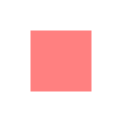

## Fill with textures

Fill shapes with textures:

```ts
const texture = await Assets.load('assets/image.png');
const obj = new Graphics().rect(0, 0, 100, 100).fill(texture);
```

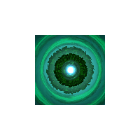

### Local vs global texture space

Textures can be applied in two coordinate spaces:

- **Local space** (default): Texture coordinates are mapped relative to the shape's dimensions. The coordinate system is normalized where (0,0) is the top-left and (1,1) is the bottom-right, regardless of pixel dimensions. A 300x200 texture filling a 100x100 shape gets scaled to fit within those 100x100 pixels.

```ts
const shapes = new Graphics()
  .rect(50, 50, 100, 100)
  .circle(250, 100, 50)
  .star(400, 100, 6, 60, 40)
  .roundRect(500, 50, 100, 100, 10)
  .fill({
    texture,
    textureSpace: 'local', // default!
  });
```

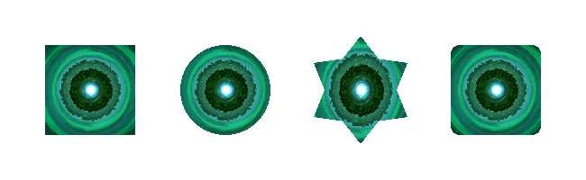

- **Global space**: Set `textureSpace: 'global'` to make the texture position and scale relative to the Graphics object's coordinate system. Despite the name, this isn't truly "global"; the texture remains fixed relative to the Graphics object itself, maintaining its position when the object moves or scales:

```ts
const shapes = new Graphics()
  .rect(50, 50, 100, 100)
  .circle(250, 100, 50)
  .star(400, 100, 6, 60, 40)
  .roundRect(500, 50, 100, 100, 10)
  .fill({
    texture,
    textureSpace: 'global',
  });
```

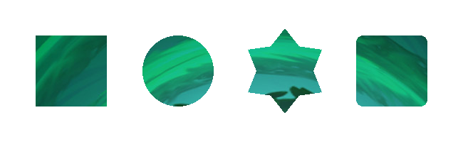

### Using matrices with textures

Apply a transformation matrix to modify texture coordinates (scale, rotate, or translate). Learn more about [texture mapping transforms](https://learnwebgl.brown37.net/10_surface_properties/texture_mapping_transforms.html#:~:text=Overview%C2%B6,by%2D4%20transformation%20matrix).

```ts
const matrix = new Matrix().scale(0.5, 0.5);

const obj = new Graphics().rect(0, 0, 100, 100).fill({
  texture: texture,
  matrix: matrix, // scale the texture down by 2
});
```

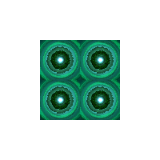

### Texture gotchas

1. **Sprite Sheets**: Texture fills use the entire source image, not the cropped frame. To fill with a specific spritesheet frame, render it to a standalone texture first:

```ts
const frame = Sprite.from('myFrame.png'); // a spritesheet frame
const standalone = renderer.generateTexture(frame);

const obj = new Graphics().rect(0, 0, 100, 100).fill(standalone);
```

2. **Power of Two Textures**: Textures should be power-of-two dimensions for proper tiling in WebGL1 (WebGL2 and WebGPU are fine).

## Fill with gradients

PixiJS supports both linear and radial gradients via the `FillGradient` class.

### Linear gradients

Linear gradients create a smooth color transition along a straight line:

```ts
const gradient = new FillGradient({
  type: 'linear',
  colorStops: [
    { offset: 0, color: 'yellow' },
    { offset: 1, color: 'green' },
  ],
});

const obj = new Graphics().rect(0, 0, 100, 100).fill(gradient);
```

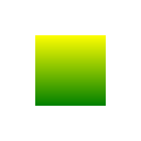

You can control the gradient direction with the following properties:

- `start {x, y}`: Where the gradient begins, in normalized coordinates (0 to 1). `{x: 0, y: 0}` = top-left, `{x: 1, y: 1}` = bottom-right.
- `end {x, y}`: Where the gradient ends, same coordinate space.

Common patterns:
- **Vertical** (default): `start: {x: 0, y: 0}`, `end: {x: 0, y: 1}`
- **Horizontal**: `start: {x: 0, y: 0}`, `end: {x: 1, y: 0}`
- **Diagonal**: `start: {x: 0, y: 0}`, `end: {x: 1, y: 1}`

```ts
const diagonalGradient = new FillGradient({
  type: 'linear',
  start: { x: 0, y: 0 },
  end: { x: 1, y: 1 },
  colorStops: [
    { offset: 0, color: 'yellow' },
    { offset: 1, color: 'green' },
  ],
});
```

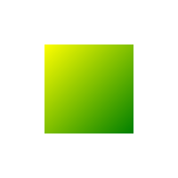

### Radial gradients

Radial gradients create a smooth color transition in a circular pattern, blending colors from one circle to another:

```ts
const gradient = new FillGradient({
  type: 'radial',
  colorStops: [
    { offset: 0, color: 'yellow' },
    { offset: 1, color: 'green' },
  ],
});

const obj = new Graphics().rect(0, 0, 100, 100).fill(gradient);
```

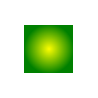

You can control the gradient's shape and size using the following properties:

- `center {x, y}`: Center of the inner circle (normalized, 0-1). Default `{x: 0.5, y: 0.5}` = shape center.
- `innerRadius`: Radius of the inner circle (normalized). The gradient starts here.
- `outerCenter {x, y}`: Center of the outer circle. Usually the same as `center`.
- `outerRadius`: Radius of the outer circle. The gradient ends here.

The gradient transitions between the two circles. Set a small `innerRadius` and larger `outerRadius` to create a spotlight effect where the center color holds before blending outward.

```ts
const radialGradient = new FillGradient({
  type: 'radial',
  center: { x: 0.5, y: 0.5 },
  innerRadius: 0.25,
  outerCenter: { x: 0.5, y: 0.5 },
  outerRadius: 0.5,
  colorStops: [
    { offset: 0, color: 'blue' },
    { offset: 1, color: 'red' },
  ],
});

const obj = new Graphics().rect(0, 0, 100, 100).fill(radialGradient);
```

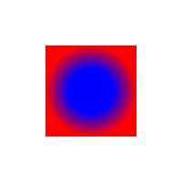

### Gradient gotchas

1. **Memory Management**: Use `fillGradient.destroy()` to free up resources when gradients are no longer needed.

2. **Animation**: Update existing gradients instead of creating new ones for better performance.

3. **Custom Shaders**: For complex animations, custom shaders may be more efficient.

4. **Texture and Matrix Limitations**: Under the hood, gradient fills set both the texture and matrix properties internally. This means you cannot use a texture fill or matrix transformation at the same time as a gradient fill.

### Combining textures and colors

Combine a texture or gradient with a color tint and alpha to overlay a color on top, adjusting transparency with the alpha value.

```ts
const gradient = new FillGradient({
  colorStops: [
    { offset: 0, color: 'blue' },
    { offset: 1, color: 'red' },
  ],
});

const obj = new Graphics().rect(0, 0, 100, 100).fill({
  fill: gradient,
  color: 'yellow',
  alpha: 0.5,
});
```

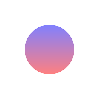

```ts
const obj = new Graphics().rect(0, 0, 100, 100).fill({
  texture: texture,
  color: 'yellow',
  alpha: 0.5,
});
```

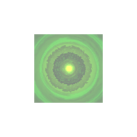

