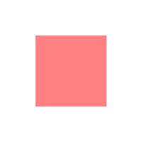
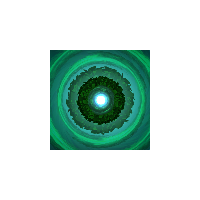
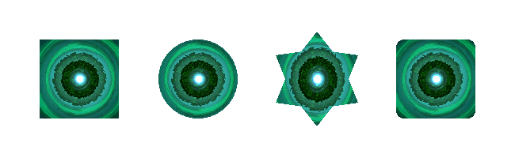
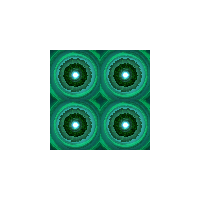
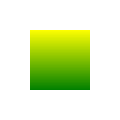
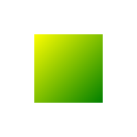
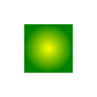
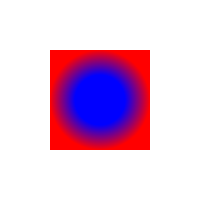
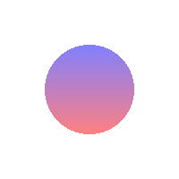
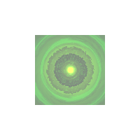

# Graphics Fill

If you're new to graphics, check out the [graphics guide](./index.md) first. This guide covers `fill()` in depth. The `fill()` method lets you fill shapes with colors, textures, or gradients.

> [!NOTE]
> The `fillStyles` discussed here can also be applied to Text objects!

## Basic color fills

Fill a `Graphics` object with a color using the `fill()` method:

```ts
const obj = new Graphics()
  .rect(0, 0, 200, 100) // Create a rectangle with dimensions 200x100
  .fill('red'); // Fill the rectangle with a red color
```


This creates a red rectangle. PixiJS supports multiple color formats:

- CSS color strings (e.g., 'red', 'blue')
- Hexadecimal strings (e.g., '#ff0000')
- Numbers (e.g., `0xff0000`)
- Arrays (e.g., `[255, 0, 0]`)
- Color objects for precise color control

### Examples:

```ts
// Using a number
const obj1 = new Graphics().rect(0, 0, 100, 100).fill(0xff0000);

// Using a hex string
const obj2 = new Graphics().rect(0, 0, 100, 100).fill('#ff0000');

// Using an array
const obj3 = new Graphics().rect(0, 0, 100, 100).fill([255, 0, 0]);

// Using a Color object
const color = new Color();
const obj4 = new Graphics().rect(0, 0, 100, 100).fill(color);
```

## Fill with a style object

For more control, pass a `FillStyle` object to customize properties like opacity:

```ts
const obj = new Graphics().rect(0, 0, 100, 100).fill({
  color: 'red',
  alpha: 0.5, // 50% opacity
});
```



## Fill with textures

Fill shapes with textures:

```ts
const texture = await Assets.load('assets/image.png');
const obj = new Graphics().rect(0, 0, 100, 100).fill(texture);
```



### Local vs global texture space

Textures can be applied in two coordinate spaces:

- **Local space** (default): Texture coordinates are mapped relative to the shape's dimensions. The coordinate system is normalized where (0,0) is the top-left and (1,1) is the bottom-right, regardless of pixel dimensions. A 300x200 texture filling a 100x100 shape gets scaled to fit within those 100x100 pixels.

```ts
const shapes = new Graphics()
  .rect(50, 50, 100, 100)
  .circle(250, 100, 50)
  .star(400, 100, 6, 60, 40)
  .roundRect(500, 50, 100, 100, 10)
  .fill({
    texture,
    textureSpace: 'local', // default!
  });
```



- **Global space**: Set `textureSpace: 'global'` to make the texture position and scale relative to the Graphics object's coordinate system. Despite the name, this isn't truly "global"; the texture remains fixed relative to the Graphics object itself, maintaining its position when the object moves or scales:

```ts
const shapes = new Graphics()
  .rect(50, 50, 100, 100)
  .circle(250, 100, 50)
  .star(400, 100, 6, 60, 40)
  .roundRect(500, 50, 100, 100, 10)
  .fill({
    texture,
    textureSpace: 'global',
  });
```


### Using matrices with textures

Apply a transformation matrix to modify texture coordinates (scale, rotate, or translate). Learn more about [texture mapping transforms](https://learnwebgl.brown37.net/10_surface_properties/texture_mapping_transforms.html#:~:text=Overview%C2%B6,by%2D4%20transformation%20matrix).

```ts
const matrix = new Matrix().scale(0.5, 0.5);

const obj = new Graphics().rect(0, 0, 100, 100).fill({
  texture: texture,
  matrix: matrix, // scale the texture down by 2
});
```



### Texture gotchas

1. **Sprite sheets**: In the default `'local'` space, a texture fill maps the whole source image (the entire atlas) onto the shape, not just the frame. Pass a `matrix` that maps the shape onto the frame's region of the source, or render the frame to a standalone texture first:

```ts
import { Matrix, Sprite } from 'pixi.js';

const { frame, source } = texture; // a spritesheet frame
const matrix = new Matrix(
  frame.width / source.width, 0,
  0, frame.height / source.height,
  frame.x / source.width, frame.y / source.height,
).invert();

const obj = new Graphics().rect(0, 0, 100, 100).fill({ texture, matrix });

// or bake the frame into its own texture
const standalone = renderer.generateTexture(Sprite.from('myFrame.png'));
```

In `'global'` space the frame origin and rotation are honored on every renderer, so a shape drawn at the frame's size shows exactly what a `Sprite` would. Tiling past the frame edges samples the surrounding atlas rather than repeating the frame.

2. **Power of Two Textures**: Textures should be power-of-two dimensions for proper tiling in WebGL1 (WebGL2 and WebGPU are fine).

## Fill with patterns

`FillPattern` tiles a texture across a fill or stroke. Pass an options object with the texture and how it repeats:

```ts
import { Assets, FillPattern, Graphics } from 'pixi.js';

const texture = await Assets.load('assets/bricks.png');

const pattern = new FillPattern({
  texture,
  repetition: 'repeat', // 'repeat' | 'repeat-x' | 'repeat-y' | 'no-repeat'
});

const obj = new Graphics().rect(0, 0, 200, 100).fill(pattern);
```

The positional form `new FillPattern(texture, 'repeat')` still works. If `repetition` is omitted the texture keeps its current wrap mode. Setting it changes the wrap mode on the texture's source, so every fill sharing that texture is affected.

### Pattern texture space

Unlike plain texture fills, patterns default to `textureSpace: 'global'`: tiles repeat continuously across the Graphics object's coordinate system, so adjacent shapes share one tiling grid. This is what you want for backgrounds and seamless textures.

```ts
const pattern = new FillPattern({ texture, repetition: 'repeat' }); // global by default

const shapes = new Graphics()
  .rect(0, 0, 60, 60)
  .fill(pattern)
  .rect(64, 64, 60, 60)
  .fill(pattern); // the same grid continues into the second rect
```

Pass `textureSpace: 'local'` to stretch a single tile to each shape's bounds instead:

```ts
const fitted = new FillPattern({ texture, repetition: 'repeat', textureSpace: 'local' });

const shapes = new Graphics()
  .rect(0, 0, 192, 60)
  .fill(fitted) // one tile stretched over 192x60
  .rect(208, 0, 48, 60)
  .fill(fitted); // one tile stretched over 48x60
```

Set `textureSpace` on the `FillPattern` itself. When a pattern is passed inside a style object, as in `fill({ fill: pattern, textureSpace: 'local' })`, the pattern's own `textureSpace` and transform replace the style's.

### Transforming a pattern

`setTransform(matrix)` copies the matrix onto the pattern to scale, rotate, or offset the tiling. Call it with no argument to reset. In local space a scale subdivides every shape into the same grid of tiles, whatever its size:

```ts
import { Matrix } from 'pixi.js';

const grid = new FillPattern({ texture, repetition: 'repeat', textureSpace: 'local' });

grid.setTransform(new Matrix().scale(0.25, 0.25)); // 4 tiles across every shape
```

Patterns work for strokes too: `.stroke({ width: 12, fill: pattern })`. They can also fill `Text`; see the [text style guide](../text/style.md).

## Fill with gradients

PixiJS supports both linear and radial gradients via the `FillGradient` class.

### Linear gradients

Linear gradients create a smooth color transition along a straight line:

```ts
const gradient = new FillGradient({
  type: 'linear',
  colorStops: [
    { offset: 0, color: 'yellow' },
    { offset: 1, color: 'green' },
  ],
});

const obj = new Graphics().rect(0, 0, 100, 100).fill(gradient);
```



You can control the gradient direction with the following properties:

- `start {x, y}`: Where the gradient begins, in normalized coordinates (0 to 1). `{x: 0, y: 0}` = top-left, `{x: 1, y: 1}` = bottom-right.
- `end {x, y}`: Where the gradient ends, same coordinate space.

Common patterns:
- **Vertical** (default): `start: {x: 0, y: 0}`, `end: {x: 0, y: 1}`
- **Horizontal**: `start: {x: 0, y: 0}`, `end: {x: 1, y: 0}`
- **Diagonal**: `start: {x: 0, y: 0}`, `end: {x: 1, y: 1}`

```ts
const diagonalGradient = new FillGradient({
  type: 'linear',
  start: { x: 0, y: 0 },
  end: { x: 1, y: 1 },
  colorStops: [
    { offset: 0, color: 'yellow' },
    { offset: 1, color: 'green' },
  ],
});
```



### Radial gradients

Radial gradients create a smooth color transition in a circular pattern, blending colors from one circle to another:

```ts
const gradient = new FillGradient({
  type: 'radial',
  colorStops: [
    { offset: 0, color: 'yellow' },
    { offset: 1, color: 'green' },
  ],
});

const obj = new Graphics().rect(0, 0, 100, 100).fill(gradient);
```



You can control the gradient's shape and size using the following properties:

- `center {x, y}`: Center of the inner circle (normalized, 0-1). Default `{x: 0.5, y: 0.5}` = shape center.
- `innerRadius`: Radius of the inner circle (normalized). The gradient starts here.
- `outerCenter {x, y}`: Center of the outer circle. Usually the same as `center`.
- `outerRadius`: Radius of the outer circle. The gradient ends here.
- `rotation`: Rotation of the gradient in radians (default `0`).
- `scale`: Vertical scale of the gradient (default `1`). Combine with `rotation` for an elliptical gradient.
- `textureSpace`: `'local'` (default) reads all of the above as normalized 0-1 shape coordinates. `'global'` reads them as pixel coordinates of the Graphics object, so one gradient can span several shapes.

`rotation` and `scale` apply to Graphics fills only, not text.

The gradient transitions between the two circles. Set a small `innerRadius` and larger `outerRadius` to create a spotlight effect where the center color holds before blending outward.

```ts
const radialGradient = new FillGradient({
  type: 'radial',
  center: { x: 0.5, y: 0.5 },
  innerRadius: 0.25,
  outerCenter: { x: 0.5, y: 0.5 },
  outerRadius: 0.5,
  colorStops: [
    { offset: 0, color: 'blue' },
    { offset: 1, color: 'red' },
  ],
});

const obj = new Graphics().rect(0, 0, 100, 100).fill(radialGradient);
```



Use `textureSpace: 'global'` to define one gradient in pixel coordinates and share it across shapes:

```ts
const shared = new FillGradient({
  type: 'radial',
  center: { x: 64, y: 64 },
  outerRadius: 50,
  textureSpace: 'global',
  colorStops: [
    { offset: 0, color: 'white' },
    { offset: 1, color: 'red' },
  ],
});

const obj = new Graphics()
  .rect(8, 8, 50, 50)
  .fill(shared)
  .rect(64, 64, 56, 56)
  .fill(shared); // both rects sample the same 100px gradient
```

### Gradient gotchas

1. **Memory Management**: Use `fillGradient.destroy()` to free up resources when gradients are no longer needed.

2. **Animation**: Update existing gradients instead of creating new ones for better performance.

3. **Custom Shaders**: For complex animations, custom shaders may be more efficient.

4. **Texture and Matrix Limitations**: Under the hood, gradient fills set both the texture and matrix properties internally. This means you cannot use a texture fill or matrix transformation at the same time as a gradient fill.

### Combining textures and colors

Combine a texture or gradient with a color tint and alpha to overlay a color on top, adjusting transparency with the alpha value.

```ts
const gradient = new FillGradient({
  colorStops: [
    { offset: 0, color: 'blue' },
    { offset: 1, color: 'red' },
  ],
});

const obj = new Graphics().rect(0, 0, 100, 100).fill({
  fill: gradient,
  color: 'yellow',
  alpha: 0.5,
});
```



```ts
const obj = new Graphics().rect(0, 0, 100, 100).fill({
  texture: texture,
  color: 'yellow',
  alpha: 0.5,
});
```



